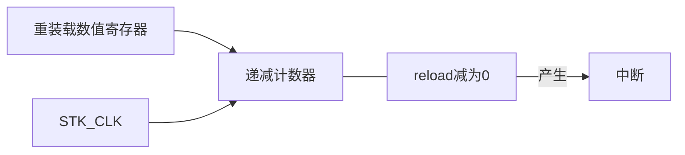

# 系统定时器(SysTick)

## 目录

[简述](#简述)

[功能框图](#功能框图)

[定时时间计算](#定时时间计算)

[寄存器](#寄存器)

[ - 结构体](#结构体)

[配置函数](#配置函数)
 
[ - 中断优先级](#中断优先级)


## 简述

SysTick

- 系统定时器
- 24位
- 只能递减，存在于内核，嵌套在`NVIC`中，所有的Cortex-M内核的单片机都具有这个定时器


## 功能框图



- 递减计数器——`STK_VAL`
- 重装载数值寄存器——`STK_LOAD`
- `STK_CLK`——`72M`或者`9M`

`递减计数器counter`在时钟的驱动下，从`重装载数值寄存器reload`初值开始往下递减计数到0，产生中断和置位`COUNTFLAG`标志。然后又从`reload`值开始**重新递减计数**。

## 定时时间计算

* 1-`t`：一个计数循环的时间，跟`reload`和`CLK`有关

* 2-`CLK`：**72M**或者**9M**，由`CTRL`寄存器配置

* 3-`RELOAD`：**24位**，用户自己配置

  

$$
时间单位换算：1s=1000ms=1000 000us=1000000000ns\\
t=reload * (1/CLK)
$$

$$
CLK=72M:\\
t=(72)*(1/72M)=1us\\
t=(72000)*(1/72M)=1ms
$$

## 寄存器

### SysTick控制及状态寄存器`STK_CTRL`

* 偏移地址：0x00

| 位段(bit) | 名称        | 类型 | 复位值 | 描述                                                         |
| --------- | ----------- | ---- | ------ | ------------------------------------------------------------ |
| 31:17     | `Reserved`  |      |        | 保留                                                         |
| 16        | `COUNTFLAG` | R/W  | 0      | 如果在上次读取本寄存器后，SysTick已经计到了0，则该位为1      |
| 15:3      | `Reserved`  |      |        | 保留                                                         |
| 2         | `CLKSOURCE` | R/W  | 0      | 时钟源选择位，0=AHB/8，1=处理器时钟AHB                       |
| 1         | `TICKINT`   | R/W  | 0      | 1=SysTick倒数计数到0时产生**SysTick异常请求**，0=数到0时无动作。也可以通过**读取COUNTFLAG标志位**来确定计数器是否递减到0 |
| 0         | `ENABLE`    | R/W  | 0      | SysTick定时器的使能位                                        |


### SysTick重装数值寄存器`STK_LOAD`

- 偏移地址：0x04

| 位段(bit) | 名称       | 类型 | 复位值 | 描述                            |
| --------- | ---------- | ---- | ------ | ------------------------------- |
| 31:24     | `Reserved` |      |        | 保留                            |
| 23:0      | `RELOAD`   | R/W  | 0      | 当倒数计数至0时，将被重装载的值 |


### SysTick当前数值寄存器`STK_VAL`

- 偏移地址：0x08

| 位段(bit) | 名称       | 类型 | 复位值 | 描述                                   |
| --------- | ---------- | ---- | ------ | -------------------------------------- |
| 31:24     | `Reserved` |      |        | 保留                                   |
| 23:0      | `CURRENT`  | R/W  | 0      | 读取时返回当前倒计数的值，写它则使之清 |


### SysTick校准值寄存器`STK_CALIB`

【基本上不会用到】

- 偏移地址：0x0C

* 系统滴答校准值固定为**9000**
* 当系统滴答时钟设定为**9MHz**[^HCLK/8的最大值]，产生**1ms**时间基准

| 位段(bit) | 名称      | 类型 | 复位值 | 描述                                                         |
| --------- | --------- | ---- | ------ | ------------------------------------------------------------ |
| 31        | `NOREF`   | R    | 0      | 1=没有外部参考时钟（`STCLK`不可用），0=外部参考时钟可用      |
| 30        | `SKEW`    | R    | 1      | 1=校准值不是准确的10ms，1=校准值是准确的10ms                 |
| 29:24     | `Rserved` |      |        | 保留                                                         |
| 23:0      | `TENMS`   | R    | 0      | 校准值，固定为**9000**。`该值与产品相关，请参考SysTick产品参考手册 `当`HCLK`被软件在最大频率，系统滴答定时器计时1ms。如果不知道校准信息，可以从处理器时钟或外部输入时钟的频率计算而来。 |

### 结构体

- 在固件库文件：`core_cm3.h`中定义

```c
typedef struct
{
    __IO uint32_t CTRL; //控制及状态寄存器
    __IO uint32_t LOAD; //重装载数值寄存器
    __IO uint32_t VAL;  //当前数值寄存器
    __I  uint32_t CALIB;//校准寄存器
}SysTick_Type;
```

## 配置函数

配置函数：`SysTick_Config(uint32_t ticks)`

- 在固件库文件：`core_cm3.h`中定义

```c
static __INLINE uint32_t SysTick_Config(uint32_t ticks)
{ 
  //reload 寄存器为24bit，最大值为2^24
  //判断tick的值是否大于2^24，如果大于，则不符合规则
  if (ticks > SysTick_LOAD_RELOAD_Msk)  return (1);
    
  //配置reload寄存器的初始值
  SysTick->LOAD  = (ticks & SysTick_LOAD_RELOAD_Msk) - 1;
   
  //配置中断优先级为 1<<4-1=15，默认为最低的优先级
  NVIC_SetPriority (SysTick_IRQn, (1<<__NVIC_PRIO_BITS) - 1); 
    
  //配置 counter 计数器的值
  SysTick->VAL   = 0;
    
  //配置systick的时钟为72M
  //使能中断
  //使能systick
  SysTick->CTRL  = SysTick_CTRL_CLKSOURCE_Msk | 
                   SysTick_CTRL_TICKINT_Msk   | 
                   SysTick_CTRL_ENABLE_Msk;     
  return (0);                                   
}
```

内部调用`NVIC_SetPriority(IRQn_Type IRQn, uint32_t priority)`函数

- `IROn`——中断源
- `priority`——优先级

```c
static __INLINE void NVIC_SetPriority(IRQn_Type IRQn, uint32_t priority)
{
  if(IRQn < 0) 
  {
    SCB->SHP[((uint32_t)(IRQn) & 0xF)-4] = ((priority << (8 - __NVIC_PRIO_BITS)) & 0xff); 
  } 
  else 
  {
    NVIC->IP[(uint32_t)(IRQn)] = ((priority << (8 - __NVIC_PRIO_BITS)) & 0xff);   
  } 
}
```

已知内核里面的外设的中断编号均小于0，因此第4行的判断语句是在判断这个中断源是**内核**里的还是**片上**的。

- 如果是内核外设，则操作SCB的SHP寄存器
  - 系统中断优先级寄存器`SCB_SHPRx`

下表是`SCB`的`SHPRx`寄存器的设置规则

<table>
    <tr>
        <td>Handler</td>
        <td>Field</td>
        <td>Regiser description</td>
    </tr>
    <tr>
        <td>Memory management fault</td>
        <td>PRI_4</td>
        <td rowspan="3">System handler priority register 1(SCB_SHPR1)</td>
    </tr>
    <tr>
        <td>Bus fault</td>
        <td>PRI_5</td>
    </tr>
    <tr>
        <td>Usage fault</td>
        <td>PRI_6</td>
    </tr>
    <tr>
        <td>SVCall</td>
        <td>PRI_11</td>
        <td>System handler priority register 2(SCB_SHPR2)</td>
    </tr>
    <tr>
        <td>PendSV</td>
        <td>PRI_14</td>
        <td rowspan="2">System handler priority register 3(SCB_SHPR3)</td>
    </tr>
    <tr>
        <td>SysTick</td>
        <td>PRI_15</td>
    </tr>
</table>

可以看到`SysTick`应该设置**PRI_15位**

对应表格应为 `SCB_SHPR3`

*  `SCB_SHPR3`

<table>
    <tr>
        <td>31</td>
        <td>30</td>
        <td>29</td>
        <td>28</td>
        <td>27</td>
        <td>26</td>
        <td>25</td>
        <td>24</td>
        <td>23</td>
        <td>22</td>
        <td>21</td>
        <td>20</td>
        <td>19</td>
        <td>18</td>
        <td>17</td>
        <td>16</td>
    </tr>
    <tr>
        <td align="center" colspan="4">PRI_15[7:4]</td>
        <td colspan="4" align="center">PRI_15[3:0]</td>
        <td colspan="4" align="center">PRI_14[7:4]</td>
        <td colspan="4" align="center">PRI_14[3:0]</td>
    </tr>
    <tr>
        <td>rw</td>
        <td>rw</td>
        <td>rw</td>
        <td>rw</td>
        <td>r</td>
        <td>r</td>
        <td>r</td>
        <td>r</td>
        <td>rw</td>
        <td>rw</td>
        <td>rw</td>
        <td>rw</td>
        <td>r</td>
        <td>r</td>
        <td>r</td>
        <td>r</td>
    </tr>
</table>

<table>
    <tr>
        <td>15</td>
        <td>14</td>
        <td>13</td>
        <td>12</td>
        <td>11</td>
        <td>10</td>
        <td>9</td>
        <td>8</td>
        <td>7</td>
        <td>6</td>
        <td>5</td>
        <td>4</td>
        <td>3</td>
        <td>2</td>
        <td>1</td>
        <td>0</td>
    </tr>
    <tr>
        <td align="center" colspan="16">Reserved</td>
    </tr>
</table>

在[中断](中断.md)章节有讲过STM32设置优先级只用到高四位而不用低四位，因此只需要配置**PRI_15**的高四位。

- 如果是片上外设，则操作`NVIC`的`IP`寄存器
  - 中断优先级寄存器`NVIC_IPRx`

下表是`NVIC`的`IPRx`寄存器的设置规则

每个寄存器保存4个位的优先级，映射到CMSIS中断优先级数组IP[0]->IP[67]，如下表所示

<table>
    <tr>
        <td> </td>
        <td align="left">31</td>
        <td align="right">24</td>
        <td align="left">23</td>
        <td align="right">16</td>
        <td align="left">15</td>
        <td align="right">8</td>
        <td align="left">7</td>
        <td align="right">0</td>
    </tr>
    <tr>
        <td>IPR20</td>
        <td colspan="2" align="center">Reserved</td>
         <td colspan="2" align="center">Reserved</td>
         <td colspan="2" align="center">Reserved</td>
         <td colspan="2" align="center">Reserved</td>
    </tr>
    <tr>
        <td>...</td>
        <td colspan="8" align="center">...</td>
    </tr>
    <tr>
        <td align="center">IPRm</td>
         <td colspan="2" align="center">IP[4m+3]</td>
         <td colspan="2" align="center">IP[4m+2]</td>
         <td colspan="2" align="center">IP[4m+1]</td>
         <td colspan="2" align="center">IP[4m]</td>
    </tr>
    <tr>
        <td align="center">...</td>
        <td colspan="8" align="center">...</td>
    </tr>
     <tr>
        <td align="center">IPR0</td>
         <td colspan="2" align="center">IP[3]</td>
         <td colspan="2" align="center">IP[2]</td>
         <td colspan="2" align="center">IP[1]</td>
         <td colspan="2" align="center">IP[0]</td>
    </tr>
</table>


<table>
    <tr>
        <th align="center">Bits</th>
        <th align="center">Name</th>
        <th align="center">Function</th>
    </tr>
    <tr>
        <td>[31:24]</td>
        <td>Priority, byte offset 3</td>
        <td rowspan="4">Each priority field holds a priority value, 0-255. The lower the value, 
the greater the priority of the corresponding interrupt. The processor 
implements only bits[7:4] of each field, bits[3:0] read as zero and 
ignore writes.</td>
    </tr>
    <tr>
        <td>[23:16] </td>
        <td>Priority, byte offset 2</td>
    </tr>
    <tr>
        <td>[15:8] </td>
        <td>Priority, byte offset 1</td>
    </tr>
    <tr>
        <td>[7:0] </td>
        <td>Priority, byte offset 0</td>
    </tr>
</table>


### 中断优先级

- SysTick属于内核里面的外设，他的中断优先级跟片上外设的中断优先级相比，哪个高？

* SysTick中断优先级配置的是`SCB->SHPRx`寄存器；而外设的中断优先级配置的是`NVIC->IPRx`有优先级分组，有抢占优先级和子优先级的说法。

STM32里面无论是内核还是外设都是使用4个二进制位来表示中断优先级。

中断优先级的分组对内核和外设**同样适用**。当比较的时候，只需要把内核外设的中断优先级的四个位按照外设的中断优先级来分组解析即可，即**人为**的分出抢占优先级和子优先级。
